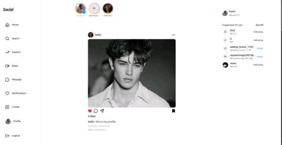
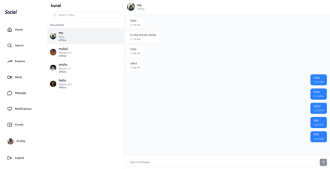
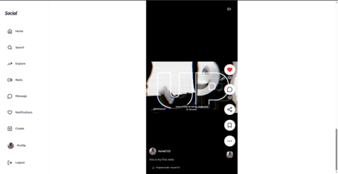
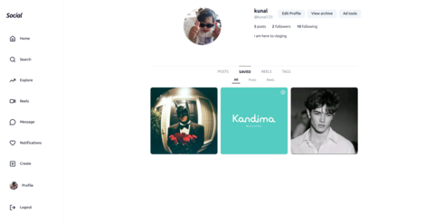
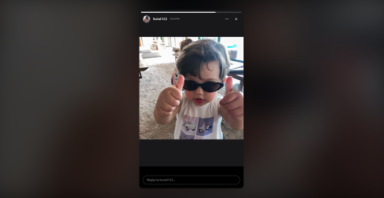
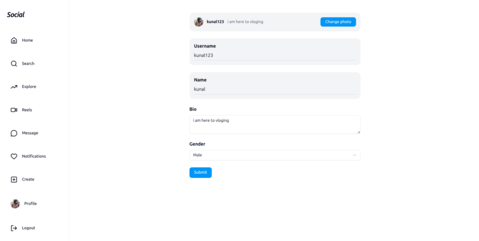
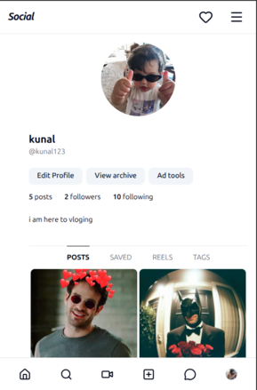
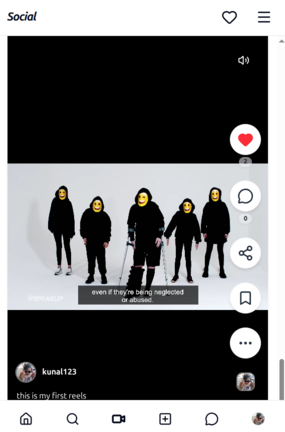
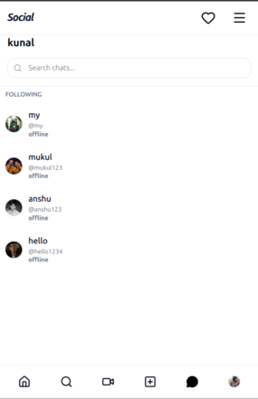

# 📱 MERN Social Media Platform

A full-stack social media application built with the MERN stack, featuring real-time messaging, stories, posts, reels, and more.

🔗 **Live Demo:** [https://mern-social-media-feat.onrender.com](https://mern-social-media-feat.onrender.com)

## 📸 Screenshots

### Desktop View
<div align="center">
  
  
  
  
  
  
</div>

### Mobile View
<div align="center">
  
  
  
  
</div>

## ✨ Features

### 🔐 Authentication & User Management
- User registration and login with JWT authentication
- Secure password hashing with bcrypt
- Profile management with bio, profile picture, and gender
- Follow/unfollow users
- View followers and following lists

### 📝 Posts & Content
- Create posts with images
- Create reels with videos
- Add captions to posts and reels
- Like and unlike posts
- Comment on posts
- Bookmark posts for later
- Mark posts as favorites
- Delete your own posts

### 📖 Stories
- Create stories with images or videos
- 24-hour auto-expiry for stories
- View who has seen your stories
- Browse stories from users you follow

### 💬 Real-time Messaging
- Real-time chat powered by Socket.IO
- One-on-one messaging
- Message read receipts
- Online/offline user status
- Conversation history

### 🔔 Notifications
- Real-time notifications for:
  - New followers
  - Likes on your posts
  - Comments on your posts
  - New messages

### 🎨 UI/UX Features
- Responsive design (mobile, tablet, desktop)
- Dark mode support
- Modern UI with shadcn/ui components
- Smooth animations and transitions
- Image optimization with Sharp
- Video/image uploads via Cloudinary

## 🛠️ Tech Stack

### Frontend
- **React** 19.1.1 - UI library
- **Vite** 7.1.2 - Build tool and dev server
- **Redux Toolkit** 2.9.0 - State management
- **React Router** 7.9.1 - Client-side routing
- **Tailwind CSS** 4.1.13 - Utility-first CSS framework
- **shadcn/ui** - Re-usable component library
- **Socket.IO Client** 4.8.3 - Real-time communication
- **Axios** 1.12.2 - HTTP client
- **Lucide React** - Icon library
- **date-fns** - Date utility library
- **Redux Persist** - State persistence
- **Sonner** - Toast notifications

### Backend
- **Node.js** - Runtime environment
- **Express** 5.1.0 - Web framework
- **MongoDB** - NoSQL database
- **Mongoose** 8.18.1 - ODM for MongoDB
- **Socket.IO** 4.8.3 - Real-time bidirectional communication
- **JWT** 9.0.2 - Token-based authentication
- **bcryptjs** 3.0.2 - Password hashing
- **Cloudinary** 2.7.0 - Media storage and optimization
- **Multer** 2.0.2 - File upload middleware
- **Sharp** 0.34.3 - Image processing
- **CORS** - Cross-origin resource sharing
- **dotenv** - Environment variable management

## 📋 Prerequisites

Before you begin, ensure you have the following installed:
- **Node.js** (v20 or higher)
- **npm** or **yarn** or **bun**
- **MongoDB** (local installation or MongoDB Atlas account)
- **Cloudinary** account for media storage

## 🚀 Installation & Setup

### 1. Clone the Repository
```bash
git clone <repository-url>
cd mern-social-media
```

### 2. Backend Setup

```bash
# Navigate to backend directory
cd backend

# Install dependencies
npm install

# Create .env file
cp .env.sample .env
```

**Configure Backend Environment Variables** (`.env`):
```env
PORT=8000
MONGODB_URI=your_mongodb_connection_string
JWT_SECRET=your_jwt_secret_key
JWT_SECRET_EXPIRY=1d
CLOUDINARY_CLOUD_NAME=your_cloudinary_cloud_name
CLOUDINARY_API_KEY=your_cloudinary_api_key
CLOUDINARY_API_SECRET=your_cloudinary_api_secret
FRONTEND_URL=http://localhost:5173
```

**Start Backend Server:**
```bash
# Development mode
npm run dev

# Production mode
npm start
```

The backend server will run on `http://localhost:8000`

### 3. Frontend Setup

```bash
# Navigate to frontend directory
cd frontend

# Install dependencies
npm install

# Create .env file
cp .env.sample .env
```

**Configure Frontend Environment Variables** (`.env`):
```env
VITE_API_URL=http://localhost:8000
```

**Start Frontend Development Server:**
```bash
npm run dev
```

The frontend application will run on `http://localhost:5173`

## 📁 Project Structure

```
mern-social-media/
├── backend/
│   ├── src/
│   │   ├── controllers/     # Route controllers
│   │   ├── models/          # Mongoose models
│   │   ├── routes/          # API routes
│   │   ├── middlewares/     # Custom middlewares
│   │   ├── socket/          # Socket.IO configuration
│   │   ├── utils/           # Utility functions
│   │   ├── db/              # Database configuration
│   │   ├── app.js           # Express app setup
│   │   └── index.js         # Server entry point
│   ├── public/              # Static files
│   └── package.json
│
├── frontend/
│   ├── src/
│   │   ├── components/      # React components
│   │   │   ├── authentication/  # Auth components
│   │   │   ├── main/           # Main app components
│   │   │   └── ui/             # shadcn/ui components
│   │   ├── pages/           # Page components
│   │   ├── redux/           # Redux store and slices
│   │   ├── context/         # React context providers
│   │   ├── lib/             # Utility functions
│   │   ├── App.jsx          # Main App component
│   │   ├── main.jsx         # Entry point
│   │   └── index.css        # Global styles
│   ├── public/              # Static assets
│   └── package.json
│
└── assest-for-readme/       # Screenshots for README
```

## 🔑 API Endpoints

### Authentication
- `POST /api/v1/user/register` - Register new user
- `POST /api/v1/user/login` - Login user
- `GET /api/v1/user/logout` - Logout user

### User Management
- `GET /api/v1/user/:id/profile` - Get user profile
- `POST /api/v1/user/profile/edit` - Edit profile
- `POST /api/v1/user/followorunfollow/:id` - Follow/unfollow user
- `GET /api/v1/user/suggested` - Get suggested users

### Posts & Reels
- `POST /api/v1/post/addpost` - Create new post/reel
- `GET /api/v1/post/all` - Get all posts
- `GET /api/v1/post/reels` - Get all reels
- `GET /api/v1/post/:id` - Get single post
- `POST /api/v1/post/:id/like` - Like/unlike post
- `POST /api/v1/post/:id/comment` - Comment on post
- `DELETE /api/v1/post/delete/:id` - Delete post
- `POST /api/v1/post/:id/bookmark` - Bookmark post

### Stories
- `POST /api/v1/story/add` - Create story
- `GET /api/v1/story/all` - Get all stories
- `DELETE /api/v1/story/:id` - Delete story

### Messages
- `POST /api/v1/message/send/:id` - Send message
- `GET /api/v1/message/all/:id` - Get conversation messages
- `GET /api/v1/message/conversations` - Get all conversations

## 🔌 Socket.IO Events

### Client → Server
- `setup` - Initialize user connection
- `joinRoom` - Join chat room
- `leaveRoom` - Leave chat room

### Server → Client
- `newMessage` - New message received
- `notification` - New notification
- `userOnline` - User came online
- `userOffline` - User went offline

## 🌐 Deployment

### Backend Deployment (Render/Railway/Heroku)
1. Create a new web service
2. Connect your GitHub repository
3. Set environment variables
4. Deploy from the `backend` directory
5. Set build command: `npm install`
6. Set start command: `npm start`

### Frontend Deployment (Vercel/Netlify)
1. Create a new project
2. Connect your GitHub repository
3. Set build directory to `frontend`
4. Set build command: `npm run build`
5. Set output directory: `dist`
6. Add environment variable: `VITE_API_URL`

---

⭐ If you found this project helpful, please give it a star!
